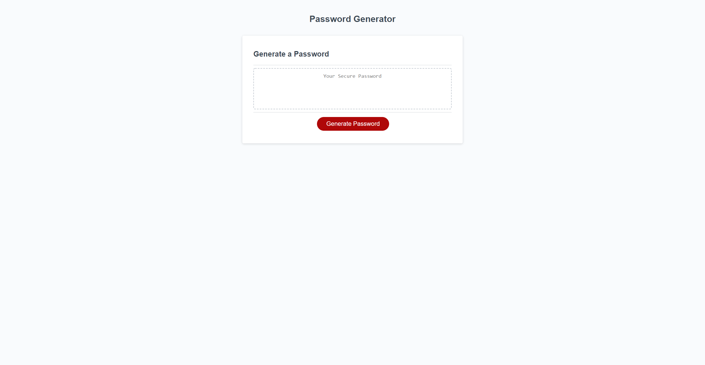

# password-generator
## Description
This is an application to generate a random password according to given criteria.  The user will answer how long they want their password, between 8 and 128 characters.
They will also be prompted to choose whether they want to include lowercase letters, uppercase letters, numbers, and/or special characters.  The application will then provide
a random string of characters that follows the user's desired criteria.

## Link to the deployed application
<https://srwagner916.github.io/password-generator/>
## Link to the GitHub repository
<https://github.com/srwagner916/password-generator>
## screenshot of the deployed application

### Shay Wagner